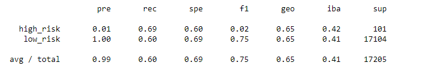
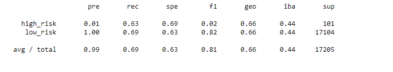
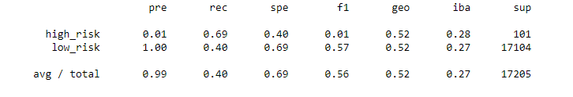
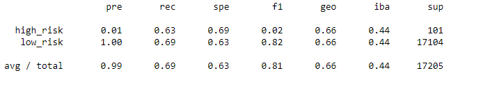
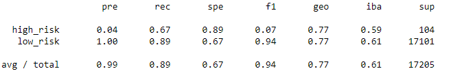
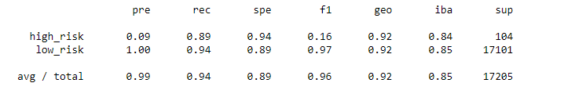

# Credit_Risk_Analysis

## Overview 
This analysis will show and compare several different tests such as oversampling, undersampling, a combination of ensemble techniques, and logistical regression to determine which machine learning models performed the best at determining credit risk. 

__Tools__:

Pandas, Python, Jupyter Notebooks
# Results

## Random Oversampling and Logistic Regression
- Accuracy Score: 0.647
- Precision: 0.99
- Recall: 0.60
- F1: 0.75

## SMOTE Oversampling
- Accuracy Score: 0.662
- Precision: 0.99
- Recall: 0.69
- F1: 0.81

## Undersampling
- Accuracy Score: 0.544
- Precision: 0.99
- Recall: 0.69
- F1: 0.56

## Combination (Over and under) Sampling 
- Accuracy Score: 0.649
- Precision: 0.99
- Recall: 0.60
- F1: 0.81

## Balanced Random Forest
- Accuracy Score: 0.79
- Precision: 0.99
- Recall: 0.70
- F1: 0.93

## Easy Ensemble AdaBoost Classifier
- Accuracy Score: 0.91
- Precision: 0.99
- Recall: 0.89
- F1: 0.96

